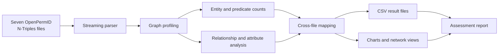
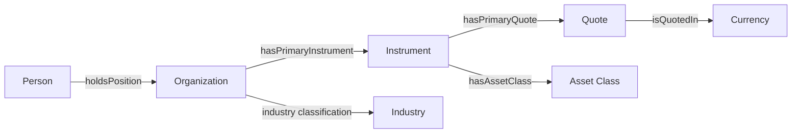

# OpenPermID Graph Data Analysis


A scalable Python analysis of seven **LSEG OpenPermID** graph datasets, completed as part of the **Junior Data Scientist Skills Assessment 2026**.

The project profiles RDF graph structure, examines entities, predicates, relationships, and literal attributes, performs cross-file analysis, and produces reusable CSV outputs and visual findings.

> **Prepared by Salah Hossam**

## Assessment Report

The complete presentation summarizing the methodology, findings, charts, and graph interpretation is available here:

[View the PowerPoint Assessment Report](docs/LSEG_OpenPermID_Assessment_Report_PowerPoint_Updated.pptx)

---

## Project Overview

The analysis covers the following OpenPermID datasets:

- Asset Class
- Currency
- Industry
- Instrument
- Organization
- Person
- Quote

Because several files contain millions of RDF triples, the solution uses a **streaming, line-by-line N-Triples parser**. This avoids loading the full datasets into memory and keeps the workflow practical for large local files.

### Main objectives

- Validate and parse all seven `.ntriples` files
- Profile the size and structure of each graph
- Count entity types, predicates, relationships, and attributes
- Analyze the hierarchy of asset classes
- Map instruments to their referenced asset classes
- Examine the Industry ontology and generate a network view
- Study Organization, Person, Quote, and Instrument coverage
- Export structured CSV files for reproducibility and further analysis

---

## Methodology



The workflow consists of five main stages:

1. **Load and validate files** using the expected OpenPermID filenames.
2. **Parse one line at a time** and distinguish URI relationships from literal attributes.
3. **Profile each graph** by counting triples, subjects, predicates, entity types, relationships, and attributes.
4. **Perform cross-file analysis**, especially the mapping between Instrument and Asset Class data.
5. **Export results and visual findings** for review and reproducibility.

---

## Repository Structure

```text
LSEG-OpenPermID-Graph-Analysis/
│
├── main.py
├── README.md
├── requirements.txt
├── .gitignore
│
├── data/
│   ├── README.md
│   ├── OpenPermID-bulk-assetClass.ntriples
│   ├── OpenPermID-bulk-currency.ntriples
│   ├── OpenPermID-bulk-industry.ntriples
│   ├── OpenPermID-bulk-instrument.ntriples
│   ├── OpenPermID-bulk-organization.ntriples
│   ├── OpenPermID-bulk-person.ntriples
│   └── OpenPermID-bulk-quote.ntriples
│
├── results/
│   ├── overall_summary.csv
│   ├── assets_by_asset_class.csv
│   ├── industry_entity_types.csv
│   ├── industry_network_edges.csv
│   └── dataset-level CSV outputs
│
└── docs/
    └── LSEG_OpenPermID_Assessment_Report_PowerPoint_Updated.pptx
```

> The raw OpenPermID files may be excluded from the repository because of their size or distribution conditions. When omitted, place a short `README.md` in the `data/` folder explaining how authorized reviewers can obtain them.

---

## Dataset Summary

The complete run processed **135,081,198 RDF triples** across seven files with **zero parsing errors**.

| Dataset | Total triples | File-level subject records | Unique predicates |
|---|---:|---:|---:|
| Person | 88,868,954 | 12,906,804 | 27 |
| Organization | 34,212,688 | 4,177,803 | 23 |
| Quote | 10,292,470 | 1,317,465 | 9 |
| Instrument | 1,690,866 | 255,879 | 7 |
| Industry | 6,380 | 1,065 | 6 |
| Asset Class | 5,961 | 1,363 | 5 |
| Currency | 3,879 | 459 | 13 |
| **Total** | **135,081,198** | **18,660,838** | — |

The Person dataset is the largest file and represents approximately **65.8%** of all parsed triples. Organization contributes a further **25.3%**, making people and organizations the dominant domains in the graph export.

---

## Key Findings

### Currency graph

- **459** currency-related nodes
- **288** `Currency` entities
- **171** `CurrencySubunit` entities
- **3,879** triples
- Important relationships include:
  - `isCurrencyOf`
  - `isPrimaryCurrencyOf`
  - `isCurrencySubunitOf`

### Asset Class graph

- **1,363** asset-class nodes
- **1,292** hierarchy relationships
- **254,761** instruments contain an asset-class relationship
- **32** asset classes are referenced by instruments in this export
- **Ordinary Shares** is the dominant class:
  - **202,792** instruments
  - Approximately **79.6%** of classified instruments

### Industry graph

- **1,065** total nodes
- **1,055** `BusinessClassification` nodes
- **10** `EconomicSector` nodes
- The hierarchy is represented through the `broader` relationship
- The main graph edges are:
  - `BusinessClassification → BusinessClassification`: **1,027**
  - `BusinessClassification → EconomicSector`: **28**

The implementation uses the ontology labels found in the source data: **`BusinessClassification`** and **`EconomicSector`**.

### Organization graph

- **4,177,803** subject records
- **34,212,688** triples
- **23** predicates
- Major relationships describe:
  - Activity status
  - Domicile
  - Country of incorporation
  - Business sector and industry classification
  - Primary instruments and quotes

### Person graph

- **12,906,804** subject records
- **88,868,954** triples
- **9** entity classes
- **4,381,660** Person entities
- The graph also contains tenure, qualification, officership, and directorship records

### Quote graph

- **1,317,465** subject records
- **10,292,470** triples
- Quotes connect instruments to exchanges through relationships such as:
  - `isQuoteOf`
  - `isQuotedIn`
- Common identifiers include RIC, exchange code, exchange ticker, and MIC

### Instrument graph

- **255,879** instrument subjects
- **1,690,866** triples
- **254,761** instruments have asset-class coverage, approximately **99.6%**
- **193,189** instruments have a primary quote, approximately **75.5%**
- Every instrument is linked to an issuing organization in the analyzed export

---

## Cross-Dataset Graph Interpretation

The seven files form a connected business graph:



This structure connects:

- People to organizations through professional positions and tenure
- Organizations to industries and economic sectors
- Organizations to issued instruments
- Instruments to asset classes and primary quotes
- Quotes to trading venues, identifiers, and currencies

---

## Generated Outputs

Running `main.py` creates summary and detail files inside `results/`.

### Main result files

| File | Description |
|---|---|
| `overall_summary.csv` | File-level triple, subject, predicate, entity-type, and parsing-error counts |
| `assets_by_asset_class.csv` | Number of instruments connected to each asset class |
| `industry_entity_types.csv` | Counts of Industry RDF entity types |
| `industry_network_edges.csv` | Aggregated Industry type-to-type graph relationships |

### Per-dataset files

For every dataset, the program exports:

```text
<dataset>_predicates.csv
<dataset>_relationships.csv
<dataset>_attributes.csv
<dataset>_entity_types.csv
```

These files make the analysis easy to audit, reuse, or extend without rerunning every exploratory step.

---

## Installation

### 1. Clone the repository

```bash
git clone <your-repository-url>
cd LSEG-OpenPermID-Graph-Analysis
```

### 2. Create a virtual environment

```bash
python -m venv .venv
```

Activate it on Windows:

```bash
.venv\Scripts\activate
```

Activate it on macOS or Linux:

```bash
source .venv/bin/activate
```

### 3. Install dependencies

```bash
pip install -r requirements.txt
```

The analysis requires:

```text
pandas
matplotlib
networkx
```

---

## Data Preparation

Place the seven source files in the `data/` folder using these exact filenames:

```text
OpenPermID-bulk-assetClass.ntriples
OpenPermID-bulk-currency.ntriples
OpenPermID-bulk-industry.ntriples
OpenPermID-bulk-instrument.ntriples
OpenPermID-bulk-organization.ntriples
OpenPermID-bulk-person.ntriples
OpenPermID-bulk-quote.ntriples
```

The program validates all required paths before starting. A missing source file raises a clear `FileNotFoundError`.

---

## Running the Analysis

```bash
python main.py
```

The script will:

1. Validate the seven datasets
2. Stream and parse every N-Triples line
3. Print graph-level summaries
4. Produce analytical charts
5. Create the Industry network diagram
6. Save all structured result files to `results/`

For a full run, keep:

```python
MAX_LINES = None
```

During development or testing, `MAX_LINES` can be assigned a smaller value to process only part of each file.

---

## Technical Design

### Memory-efficient processing

The parser yields one RDF triple at a time instead of reading an entire file into a DataFrame. This is important because the largest source files contain tens of millions of triples.

### URI and literal separation

Objects are categorized as:

- URI
- Literal
- Blank node
- Other

URI objects are treated as graph relationships, while literal objects are treated as descriptive attributes.


## Author

**Salah Hossam**  
Data Scientist / Machine Learning Engineer

[LinkedIn](https://www.linkedin.com/in/salah-hossam-26a362275/) · [Kaggle](https://www.kaggle.com/salahhossam10/)
